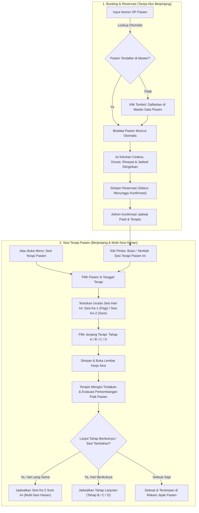

# 📋 Dokumentasi Alur Sistem Klinik Sport Therapist
**Sport Physiotherapy & Injury Rehabilitation System**  
*Darma Ayu Tekno — Sistem Terapi Berjenjang & Multi-Sesi Harian*

---

## 📌 Ringkasan Konsep Alur Sistem

Sistem klinik telah disederhanakan dan dipisahkan menjadi 2 modul utama dengan tanggung jawab yang jelas:

1. **Modul Booking / Reservasi (`/reservations`)**:
   - **Fokus Murni**: Pendataan calon kunjungan pasien dan keluhan cedera.
   - **Tanpa Alur Berjenjang**: Tidak ada pemilihan jenjang terapi rumit pada saat reservasi awal dibuat.
   - **Lookup Pasien via Nomor HP**: Cukup mengetik nomor HP, sistem akan otomatis menarik data pasien dari Master Data Pasien. Jika nomor belum terdaftar, terdapat tombol pintas untuk mendaftarkannya terlebih dahulu.
   - **Konfirmasi Jadwal**: Admin klinik mengonfirmasi tanggal/jam pasti dan menetapkan terapis penanggung jawab.

2. **Modul Sesi Terapi Pasien (`/therapy-sessions`)**:
   - **Pusat Terapi Berjenjang**: Alur tahapan berjenjang (Tahap A $\rightarrow$ Tahap B $\rightarrow$ Tahap C $\rightarrow$ Tahap D) dikelola sepenuhnya di modul ini.
   - **Dukungan Multi-Sesi Harian (>1 Terapi per Hari)**: Pasien dimungkinkan menjalani lebih dari satu sesi terapi dalam 1 hari yang sama (misalnya: Sesi Ke-1 pada pagi hari untuk penanganan akut/manual therapy, dan Sesi Ke-2 pada sore hari untuk stimulasi/mobilisasi).
   - **Lembar Kerja & Evaluasi**: Terapis mendokumentasikan tindakan yang diberikan, mengevaluasi skala nyeri (VAS) serta lingkup gerak sendi (ROM), dan dapat langsung membuka tahapan terapi lanjutan.
   - **Rekam Jejak Kronologis**: Menampilkan visual timeline seluruh tahapan pemulihan pasien dari sesi pertama hingga akhir.

---

## 🔄 Diagram Alur Kerja (Workflow Diagram)

---

## 🧭 Panduan Uji Coba Langkah demi Langkah (Testing Guide)

### Skenario 1: Membuat Reservasi Pasien Baru
1. Buka menu **Buat Reservasi** (`/reservations/create`).
2. Masukkan nomor HP pasien:
   - **Pasien Lama (Terdaftar)**: Ketik nomor `085183036722` $\rightarrow$ Card hijau biodata pasien (*lathiif aji santhosho*) muncul otomatis.
   - **Pasien Baru**: Ketik nomor yang belum terdaftar $\rightarrow$ Card kuning muncul dengan pesan peringatan dan tombol **"Input Data Pasien di Master Data Pasien"**.
3. Isi bagian **Keluhan Cedera & Rencana Jadwal Terapi**:
   - **Keluhan Utama Cedera**: `Nyeri hamstring paha belakang pasca sprint sepak bola`
   - **Berapa Lama Keluhan**: `2 hari`
   - **Riwayat Medis**: `Pernah kram otot berulang`
   - **Hari & Jam yang Diinginkan**: `Jumat Pagi, 09:00 WIB`
   - **Pilihan Terapis**: Pilih `Terapis Farhan` (atau biarkan ditentukan klinik).
4. Klik tombol **Kirim Data Reservasi**.
5. Sistem mengarahkan ke halaman **Detail Reservasi** (`/reservations/{id}`):
   - Jika status masih *Menunggu Konfirmasi*, isi tanggal/jam pasti lalu klik **✓ Konfirmasi Jadwal Terapi**.
   - Halaman reservasi hanya menampilkan ringkasan data pasien, keluhan, dan status jadwal tanpa jenjang berbelit.

---

### Skenario 2: Membuka Sesi Terapi Pertama (Tahap A / Tahap 1)
1. Dari halaman detail reservasi di atas, klik tombol **+ Buka / Tambah Sesi Terapi Pasien Ini** (atau buka menu **Sesi Terapi Pasien** $\rightarrow$ **+ Tambah Sesi Terapi Baru**).
2. Perhatikan kolom pada formulir:
   - Data pasien otomatis terpilih.
   - **Urutan Sesi Hari Ini**: Otomatis terdeteksi **Sesi Ke-1 (Utama / Sesi Pagi)**.
   - **Jenjang Terapi**: Otomatis menyarankan **Tahap 1 (Tahap A: Penanganan Akut & Myofascial Release)**.
   - Tentukan jam sesi (misal: `09:00 WIB`).
3. Klik **Simpan & Buka Sesi Terapi**.
4. Anda akan langsung masuk ke **Lembar Kerja Sesi Terapi** (`/therapy-sessions/{id}`).

---

### Skenario 3: Mencatat Tindakan & Evaluasi Sesi Terapi
1. Di **Lembar Kerja Sesi Terapi**, terapis mengisi formulir evaluasi:
   - **Tindakan / Teknik Terapi**:  
     `Cryotherapy 15 menit pada hamstring posterior, Myofascial Release, Ultrasound terapi 1.5 W/cm², dan Gentle Active ROM.`
   - **Catatan Evaluasi & Hasil**:  
     `VAS nyeri berkurang dari skala 7 ke skala 4. Pembengkakan berkurang. Pasien mampu menumpu beban lebih nyaman.`
   - **Rekomendasi Lanjutan**:  
     `Lanjut sesi sore untuk stimulasi elektroterapi dan mobilisasi ringan.`
2. Pilih opsi penyelesaian:
   - **Opsi A (Selesai)**: Klik tombol hijau **✓ Selesaikan Sesi Terapi Ini**.
   - **Opsi B (Langsung Buat Sesi Berikutnya)**: Centang kotak *"Selesaikan Sesi Ini & Langsung Buat Sesi Terapi Lanjutan"* $\rightarrow$ Tentukan waktu sesi baru (misal 3 jam lagi untuk sesi sore).

---

### Skenario 4: Mencoba Lebih dari 1 Terapi dalam 1 Hari (Multi-Sesi Harian)
Untuk menguji fitur pencatatan **lebih dari 1 terapi dalam 1 hari untuk pasien yang sama**:
1. Buka menu **Sesi Terapi Pasien** $\rightarrow$ Klik **+ Tambah Sesi Terapi Baru**.
2. Pilih pasien yang sama (*lathiif aji santhosho*) dan tanggal yang sama (hari ini).
3. Pada dropdown **Urutan Sesi Hari Ini**, pilih **Sesi Ke-2 (Sesi Lanjutan / Sesi Sore)** dengan jam sore (misal: `15:30 WIB`).
4. Pilih jenjang terapinya:
   - Bisa tetap Tahap A sesi kedua, atau naik ke Tahap B (Elektroterapi & Mobilisasi Sendi).
5. Klik **Simpan & Buka Sesi Terapi**.
6. Kembali ke halaman utama **Sesi Terapi Pasien** (`/therapy-sessions`):
   - Perhatikan tabel sesi hari ini memuat 2 sesi untuk pasien yang sama dengan badge **Sesi Ke-1** dan **Sesi Ke-2**.
   - Kartu statistik ungu di bagian atas akan otomatis mendeteksi: **"1 Pasien (>1 Terapi Hari Ini)"**.

---

### Skenario 5: Melihat Rekam Jejak Pasien (Timeline Berjenjang)
1. Pada lembar kerja atau tabel sesi pasien, klik tombol **📜 Riwayat Lengkap Pasien** (`/therapy-sessions/patient/{id}/history`).
2. Halaman ini menyajikan visual perjalanan terapi pasien secara kronologis:
   - **Tahap 1 Sesi Ke-1**: Jam 09:00 WIB (Selesai — Evaluasi VAS 7 ke 4).
   - **Tahap 1 Sesi Ke-2**: Jam 15:30 WIB (Selesai — Evaluasi VAS 4 ke 2).
   - **Tahap 2 Sesi Ke-1**: Hari berikutnya (Terjadwal).

---

## 🗂️ Referensi Master Data yang Tersedia

### Master Jenjang Terapi (`Therapy Types`)
| Kode | Jenjang | Nama Tahapan | Keterangan |
|---|---|---|---|
| `TRP-A` | Tahap 1 | **Penanganan Akut & Myofascial Release** | Reduksi nyeri akut, kompresi dingin, pelepasan fascia |
| `TRP-B` | Tahap 2 | **Elektroterapi & Mobilisasi Sendi** | TENS, stimulasi neuromuskular, peningkatan ROM |
| `TRP-C` | Tahap 3 | **Penguatan & Koreksi Biomekanika Gerak** | Penguatan otot stabilisator, perbaikan pola gerak |
| `TRP-D` | Tahap 4 | **Return to Sport Conditioning** | Latihan fungsional spesifik olahraga, agility & plyometrics |

### Master Terapis (`Therapists`)
- **Terapis Farhan, S.Tr.Kes** — *Sport Physiotherapy & Injury Rehabilitation*
- **Terapis Andra, S.Ftr** — *Manual Therapy & Athletic Conditioning*

### Contoh Nomor HP Pasien Uji Coba (`Master Patients`)
- `085183036722` — **lathiif aji santhosho** (Laki-laki)
- `086237283784` — **Dani** (Laki-laki)
- `0843847384` — **Hendra** (Laki-laki)

---

## 🌐 Daftar Rute & URL Penting

| Menu / Fitur | Rute Laravel | URL |
|---|---|---|
| Daftar Reservasi | `reservations.index` | `/reservations` |
| Buat Reservasi Baru | `reservations.create` | `/reservations/create` |
| Detail & Konfirmasi Reservasi | `reservations.show` | `/reservations/{id}` |
| Dashboard Sesi Terapi Pasien | `therapy-sessions.index` | `/therapy-sessions` *(atau `/doctor-exam`)* |
| Tambah Sesi Terapi Baru | `therapy-sessions.create` | `/therapy-sessions/create` |
| Lembar Kerja & Evaluasi Sesi | `therapy-sessions.show` | `/therapy-sessions/{id}` |
| Rekam Jejak Kronologis Pasien | `therapy-sessions.patient-history` | `/therapy-sessions/patient/{id}/history` |
| Master Data Pasien | `patients.index` | `/patients` |
| Master Jenjang Terapi | `therapy-types.index` | `/therapy-types` |
| Master Terapis | `therapists.index` | `/therapists` |
| Master Peralatan Terapi | `therapy-equipments.index` | `/therapy-equipments` |
